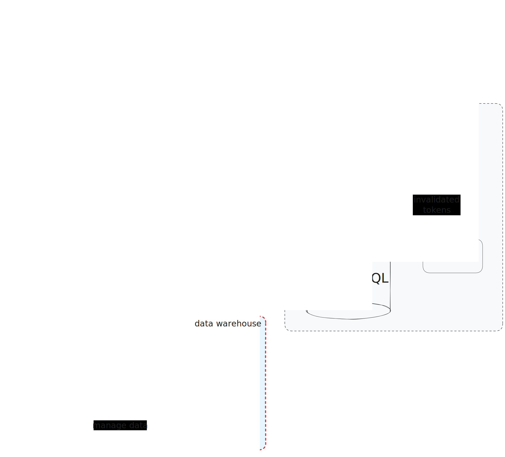

# ETL & Data warehouse

The ETL process uses a Multiple Query Extractor technique to extract data from a PostgreSQL database and load it into an Elasticsearch index. The process is designed to be run as a Docker container, and can be configured using the environment variables in the `.env` file.

## About

The project follows a microservices architecture. The ETL **data warehouse service** service is responsible for continuously extracting, transforming and loading data from `PostgreSQL` into the `Elasticsearch` DB.

Elasticsearch is used as a data warehouse by other of our services, such as the [Movies Service](https://github.com/vogelfenx/Async_API).

## Core Stack

- PostgreSQL
- Elasticsearch

**Services interaction scheme:**



## Configuration

The following environment variables can be used to configure the ETL process:

The log level to use for the ETL process. Valid values are `DEBUG`, `INFO`, `WARNING`, `ERROR`, and `CRITICAL`. The default value is `INFO`:

```conf
LOG_LEVEL = DEBUG
```

The name of the PostgreSQL database to extract data from. If running in Docker, you can use the service name of the Postgres DB:

```conf
PG_DB_NAME = <Postgres database name>
PG_USER = <Postgres user>
PG_PASSWORD = <Postgres Password>
PG_HOST = postgres_db
PG_PORT = 5432
```

The hostname of the Elasticsearch server. If running in Docker, you can use the service name of the Elasticsearch container:

```conf
ELASTICSEARCH_HOST = elasticsearch
ELASTICSEARCH_PORT = 9200
```

## Usage

To run the ETL process as a Docker container, use the following command:

```bash
docker-compose up --build
```

This will start the ETL process and the required PostgreSQL and Elasticsearch services.

## Using Kibana

To access the Kibana web interface open web browser and navigate to http://localhost:5601
